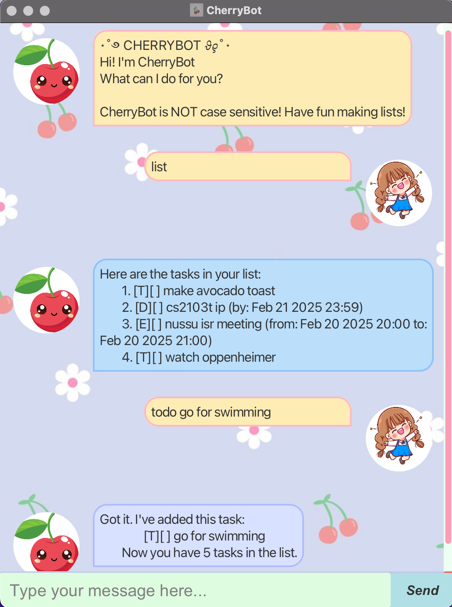

# CherryBot User Guide ⋆˚✿˖°

Welcome to CherryBot, your adorable chatbot to help manage your tasks!

## Features 

This easy to use application allows you to stay on top of your tasks using the following features:

# Adding Tasks ۶ৎ

You can add your tasks to CherryBot. These are the three types:

**Todo**
`todo <description>`

Creates a normal task with the provided description.

**Deadline**
`deadline <description> /by dd-mm-yyyy hh:MM`

Creates a task with a specific deadline. The date and time must be provided using the /by command in the format dd-mm-yyyy hh:MM.

**Event**
`event <description> /from dd-mm-yyyy hh:MM /to dd-mm-yyyy hh:MM`

Creates a task with the start and end date and time. Specify the start date time using /from command and the end date time using /to command in the format dd-mm-yyyy hh:MM.

# Managing Tasks ۶ৎ

You can manage your tasks in CherryBot using the following commands:

**Mark**
`mark <tasknumber>`

Marks the task identified by the entered task number as done. This helps you keep track of completed tasks.

**Unmark**
`unmark <tasknumber>`

Unmarks the task identified by the entered task number. Use this command to change the status of completion.

**Delete**
`delete <tasknumber>`

Deletes the task identified by the entered task number. 

**Sort**
`sort`

Sorts the tasks based on deadline and time. Use this command to see which task/event is due in an orderly manner.

# Searching and Viewing Tasks ۶ৎ

You can view and search your tasks in CherryBot using the following commands:

**Find**
`find <keyword>`

Finds all tasks that match the keyword entered. This helps you filter tasks based on a specific keyword.

**List**
`list`

Displays all tasks in your list in the order they were added. This feature helps you view all tasks at once.

# Exiting the Application ۶ৎ

You can exit the chatbot and save your changes to the storage file.

**Bye**
`bye`

Exits the chatbot and saves all tasks to storage. Use this feature to close the application.